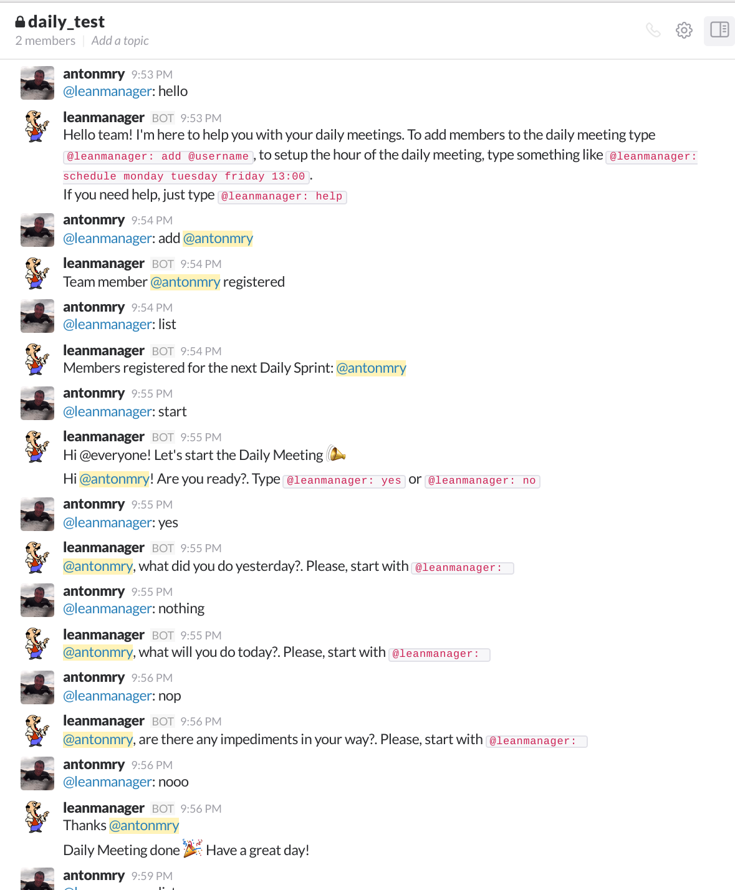

# leanmanager
It's time to replace your manager with a bot!

## Introduction

The aim of Lean Manager is to be an end-to-end solution for management of development teams using your favourite tools, not adding more. The mantra is "Keep it simple" so we can focus in development and product design, not in management, time tracking and so on.

## Bot

It's our main point of contact with leanmanager, it uses Slack [Real Time API](https://api.slack.com/rtm). Rigth now the only functionality is running the Daily meetings making the questions but more functionality will be added in the future.

To install and use leanmanager, you need Docker. Then, just execute:

```sh
docker pull leanmanager:latest
```

### Daily meetings

Daily meetings are in beta phase, but you can use them as you can see in the following screenshot:




To run it, you need to create a bot in the [slack bot creation page](https://my.slack.com/services/new/bot) and retrieve the token of your new bot. Then execute:

```sh
docker run -e LEANMANAGER_TOKEN=YOUR_TOKEN leanmanager:latest
```

By default, leanmanager stores the database inside the docker image. If you want to persist the data between sessions, you can execute:

```sh
docker run --rm -e LEANMANAGER_TOKEN=$LEANMANAGER_TOKEN -e LEANMANAGER_PATHDB=/mnt -v $(pwd):/mnt leanmanager:latest
```
